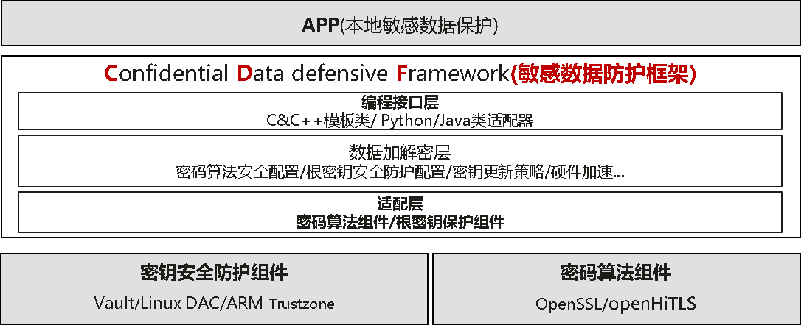

# cdf-crypto

#### 介绍

CDF的全称是Confidential Data defensive Framework，提供敏感数据保护框架SDK库，提供密码算法强度和密钥安全隔离等安全配置模板，提升敏感数据防护安全性，供开发者参考。

#### 软件架构




#### 安装教程

编译运行

1. 编译环境要求

+ 编译环境要求：OpenEuler 内核版本不低于 kernel 6.6

```
yum install -y rpm-build
yum install -y make
yum install -y cmake
yum install -y gcc
yum install -y gcc-c++
```

+ 其他依赖默认自动下载

2. 编译指导

+ 直接通过预制脚本编译

```
sh build.sh output
```

+ rpm包构建

```
sh build.sh rpm
```

+ 编译选项

```
--help         # 显示帮助信息
--debug        # debug模式
--enable       # 支持编译部分模块，用空格分隔模块
```

3. 安装指导

+ rpm包构建后进行安装

```
sudo rpm -ivh --nodes /package/rpm/cdf-crypto-*.rpm
# 设置环境变量
echo 'export LD_LIBRARY_PATH=/usr/lib64/cdf:$LD_LIBRARY_PATH' >> ~/.bashrc
source ~/.bashrc
```
#### 相关文档

- [接口文档](docs/api_documentation.md)
- [使用说明](docs/usage_guidelines.md)

#### 许可证信息

本项目遵循 Mulan PSL v2 许可证协议，详情请见 [LICENSE](LICENSE) 文件。

#### 参与贡献

1.  Fork 本仓库
2.  新建 Feat_xxx 分支
3.  提交代码
4.  新建 Pull Request


#### 特技

1.  使用 Readme\_XXX.md 来支持不同的语言，例如 Readme\_en.md, Readme\_zh.md
2.  Gitee 官方博客 [blog.gitee.com](https://blog.gitee.com)
3.  你可以 [https://gitee.com/explore](https://gitee.com/explore) 这个地址来了解 Gitee 上的优秀开源项目
4.  [GVP](https://gitee.com/gvp) 全称是 Gitee 最有价值开源项目，是综合评定出的优秀开源项目
5.  Gitee 官方提供的使用手册 [https://gitee.com/help](https://gitee.com/help)
6.  Gitee 封面人物是一档用来展示 Gitee 会员风采的栏目 [https://gitee.com/gitee-stars/](https://gitee.com/gitee-stars/)